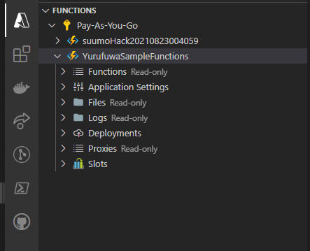

案外書ける  
Azure Functions

---

# Functions とは

aws で言う lambda にあたるサービス  
サーバレスでコードを動かしてくれる  
  
functions の名の通り
関数一つを動かすサービスみたいな感じでしょうか

---

# 対応言語 (v3)

|language|version|
|:--|:--|
|C# |.NET Core 3.1, .NET 5.0|
|javascript| node 14, 12, 10|
|F#|.NET Core 3.1|
|Java|11, 8 |
|PowerShell|7.0, Core6|
|Python|3.9(preview), 3.8, 3.7, 3.6|
|TypeScript|-(バージョンがない？）|

---

# 価格

従量課金サービスなんで怖いよね
|従量制課金|料金|無料提供 (月々)|
|:--|:--|:--|
|実行時間|¥0.001792/GB 秒|400,000GB 秒|
|総実行回数|¥22.400/100万実行|100 万実行|

--

ほかにも Premiumプラン という　ハイスペック、コールドスタート無しのプランがあります。（高い）  
無料分の範囲があるので、個人で使う分には十分に安く抑えられると思います。

---

# 作る

--

実際に作ってみる。  
当然だけど、azureのアカウントが必要です  
（ここでは説明しません）

--

## 必要なもの

- Azureアカウント
- Visual Studio Code (VisualStudioでもいいぞ！)
- [Azure Functions Extension.](https://marketplace.visualstudio.com/items?itemName=ms-azuretools.vscode-azurefunctions)

--

```
> Azure Functions: create function app in azure
```

vscodeで、`Ctrl+P` ↑のコマンドを入れて…  
名前入れて… 言語選んで… リージョン選んで…  
出来上がったものがこちらになります



--

```
>Azure Functions: Create Function
```

新たにプロジェクトを作るか？と聞かれるんで良い感じに答えると
トリガーを選べと言われる


--

## トリガーとは

作った functions を発火する為のイベント指定  
[トリガー一覧](https://docs.microsoft.com/ja-jp/azure/azure-functions/functions-triggers-bindings?tabs=csharp#supported-bindings)

一部抜粋

|トリガ名|役割|
|:--|:--|
|HttpTrigger|リクエストされたら発火|
|CosmosDBTrigger|追加・更新があったら発火|
|TimerTrigger|Cron形式で指定時間/間隔で発火|

--

なんやかんやあって勝手にプロジェクトが作られる


--

これ、なんと実行できます（ローカルデバッグ）  
※ ただし下記修正が必要(えぇ…)
```　diff
-    <PackageReference Include="Microsoft.Azure.Functions.Worker.Extensions.Http" Version="3.0.12" />
-    <PackageReference Include="Microsoft.Azure.Functions.Worker.Sdk" Version="1.0.3" OutputItemType="Analyzer" />
-    <PackageReference Include="Microsoft.Azure.Functions.Worker" Version="1.1.0" />
+    <PackageReference Include="Microsoft.Azure.Functions.Worker.Extensions.Http" Version="3.0.13" />
+    <PackageReference Include="Microsoft.Azure.Functions.Worker.Sdk" Version="1.0.4" OutputItemType="Analyzer" />
+    <PackageReference Include="Microsoft.Azure.Functions.Worker" Version="1.5.1" />
```

--

http://localhost:7071/api/YurufuwaHttpTrigger

```sh
> Executing task: func host start <


Azure Functions Core Tools
Core Tools Version:       3.0.3477 Commit hash: 5fbb9a76fc00e4168f2cc90d6ff0afe5373afc6d  (64-bit)
Function Runtime Version: 3.0.15584.0


Functions:

        YurufuwaHttpTrigger: [GET,POST] http://localhost:7071/api/YurufuwaHttpTrigger

For detailed output, run func with --verbose flag.
[2021-10-01T13:59:21.424Z] Worker process started and initialized.
[2021-10-01T13:59:26.089Z] Host lock lease acquired by instance ID '00000000000000000000000084F97866'.
```

--


---

# デプロイ

--

```
>Azure Functions: Deploy to Function App
```

ポチポチ～

--


--


---

# いかがでしたか？

functions 簡単に作れて動かせることが分かったと思います。  
次回は トリガーやバインドを少し深堀りできればと思います。  （気が乗ったら）